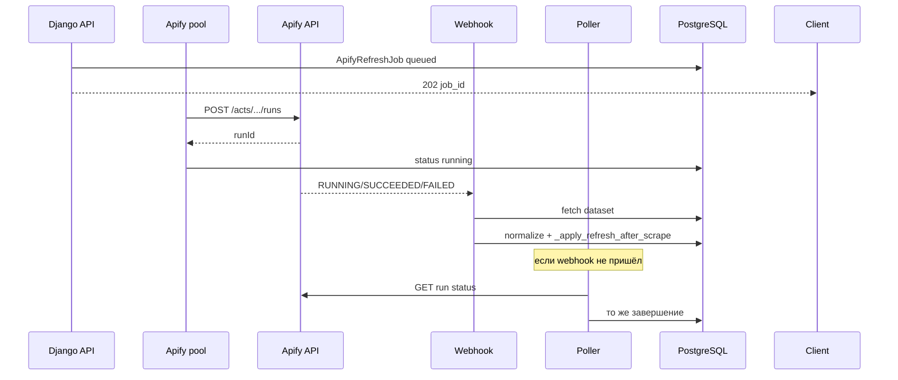

# План: Apify как альтернатива Playwright для refresh (Facebook, TikTok, Instagram, Threads, X, YouTube)

Документ фиксирует согласованные решения и план реализации. **Код по этому плану пока не писать** — только ориентир для разработки.

Дата: 2026-06-01.

---

## 1. Цели и границы

### В scope
- Сбор данных аккаунта: `POST /api/accounts/{id}/refresh/`, `refresh_all`, bulk refresh, автообновление по расписанию (`RefreshScheduleConfig` / scheduler).
- Платформы **MVP**: `facebook`, `tiktok`, `instagram`.
- Переключатель **по платформе**: `playwright` (по умолчанию) | `apify`.
- Режим Apify: **асинхронный** — старт run в Apify, запись в БД в фоне после завершения.
- UI: секция на **`/settings`** в **new_frontend** (`app.bundle.js` / патч-скрипты по принятой в проекте схеме).

### Вне scope (явно)
- **Аудитория** (`audience/refresh`) — всегда Playwright, без изменений.
- Bulk import / «добавить список с немедленным refresh» — **не интегрировать**; функция признана мёртвой, **отдельная задача на удаление** (не блокирует Apify).
- Fallback Apify → Playwright при ошибке — **нет**, строго один backend на платформу.
- Локальное скачивание аватаров/превью для Apify — **только URL** в БД (без `avatar_file` / `thumbnail_file` на этом этапе).
- Unit/integration тесты — **не делаем** в MVP (по желанию позже — фикстуры dataset → normalizer).

---

## 2. Зафиксированные решения (ответы)

| # | Решение |
|---|---------|
| Область | Всё refresh, кроме аудитории |
| Гранулярность | Только по платформе (достаточно) |
| UI | Отдельная секция «Способ сбора данных»; платформы без Apify в MVP **не показывать** |
| Хранение | Отдельный singleton `ScrapeBackendConfig`, явные поля `facebook_backend`, `tiktok_backend`, `instagram_backend` |
| Применение настройки | Только **новые** запуски refresh |
| Одиночный refresh | **HTTP 202** + `job_id` (и метаданные run) |
| Список аккаунтов | Пока job активен — статус **«В очереди Apify»** / «Сбор Apify…»; `updated_at` меняется **только после успешного** `_apply_refresh` |
| История | Таблица `ApifyRefreshJob` с полной историей |
| Завершение run | **Webhook** + **fallback polling** |
| Ошибки | Как при автообновлении (`run_detail`, CSV, `profile_unavailable` где уместно); **без retry** — сразу `failed` |
| Batch | **1 job = 1 аккаунт**; TikTok = 1 run; Facebook = **2 run** (CrowdPull → playcount); Instagram = **2 run** (profile → posts) |
| Отмена | `refresh/cancel` → Apify **abort** по `apify_run_id` |
| Actor ID | В **env** (`APIFY_ACTOR_*`) |
| FB лимит постов | ~**80** (как сейчас `FACEBOOK_MAX_POSTS`) |
| TikTok лимит видео | **Всё**, что отдаёт actor (без искусственного cap в MVP) |
| FB тип аккаунтов | **Профили**; нужны и метрики профиля, и посты |
| FB просмотры | **Второй run** [facebook-playcount-scraper](https://apify.com/social_developer/facebook-playcount-scraper) по URL Reels из CrowdPull; отдельный Reels-only actor **не нужен** |
| **Facebook Actors (выбор)** | **Гибрид:** `crowdpull/facebook-profile-scraper` + `social_developer/facebook-playcount-scraper` |
| `_posts_authoritative` | **`True`**, если run Apify завершился со статусом `SUCCEEDED` (даже при пустом списке постов) |
| `_partial` | Прокидывать из качества ответа actor → `_partial` |
| Снапшоты | Сохранять текущую схему (`take_snapshot_if_needed` до overwrite) |
| Секреты | Только `APIFY_TOKEN` (+ feature flag) в env |
| Feature flag | `APIFY_ENABLED=0` — в UI нельзя выбрать Apify, API отклоняет `apify` |
| Логирование стоимости | **Подробно** в `run_detail` и в `ApifyRefreshJob` |
| **TikTok Actor (выбор)** | **`clockworks/tiktok-profile-scraper`** — Console ID `0FXVyOXXEmdGcV88a`; env `APIFY_ACTOR_TIKTOK` |
| IG лимит постов | `resultsLimit` ≈ **80** (как ориентир; worker сейчас ~20 timeline + merge `/reels/`) |
| **Instagram Actors (выбор)** | **Гибрид:** `apify/instagram-profile-scraper` + `apify/instagram-scraper` |
| **Threads Actors (тест)** | Кандидат **1 run:** `automation-lab/threads-scraper`; **Apify для Threads в MVP отложен** — нет `view_count` в dataset (см. §3) |
| **X Actors (тест)** | Кандидат постов: `scraper_one/x-profile-posts-scraper`; **Apify для X в MVP отложен** — нет `view_count` / apidojo отдаёт demo (см. §3) |
| **YouTube Actors (тест)** | Кандидат: `streamers/youtube-scraper`; channel-scraper — для крупных каналов; **по умолчанию оставить YouTube Data API** (см. §3) |

### Решения по пунктам «не знаю» (приняты в плане)

| Вопрос | Решение |
|--------|---------|
| **37** Зачем отдельный лимит пула Apify | `AUTO_REFRESH_WORKERS` ограничивает **потоки Playwright** (локальный Chrome). Apify — **удалённые** run’ы с лимитом аккаунта Apify и биллингом. Нужен **`APIFY_MAX_CONCURRENT_RUNS`** (env, default 3): сколько run’ов одновременно **стартуем/держим в RUNNING**, независимо от Playwright. Иначе при `refresh_all` на 100 FB можно случайно открыть 100 run’ов. |
| **46** Где показывать активные Apify jobs | (1) В списке аккаунтов — поле из serializer. (2) В `run_detail` refresh_all/bulk/scheduler — `backend: "apify"`, `apify_run_id`, стадия, CU/USD. (3) В `/settings` — одна строка «Активных задач Apify: N» (если N>0), без отдельной страницы. |
| **47** FB warm при Apify | Если `facebook_backend == apify` — **полностью пропускать** `RefreshAllWarmTracker` / прогрев / `FacebookRefreshBatchGuard` / prewarm Playwright для Facebook, **независимо** от `refresh_warm_enabled` в расписании. |
| **51** Счётчик `processed_accounts` | **Один общий** счётчик: +1 когда аккаунт завершён (успех или fail) по **любому** backend. Playwright и Apify в одном `refresh_all` **параллельно** (см. ниже). |

---

## 3. Apify Actors

### TikTok — зафиксированный выбор

| | |
|---|---|
| **Actor** | [`clockworks/tiktok-profile-scraper`](https://apify.com/clockworks/tiktok-profile-scraper) |
| **Console** | https://console.apify.com/actors/0FXVyOXXEmdGcV88a |
| **Env** | `APIFY_ACTOR_TIKTOK=clockworks/tiktok-profile-scraper` (default в коде — то же значение) |
| **Модель цены** | Pay-per-event / result, витрина от ~**$2.50 / 1 000 results** (~$0.0025/строка dataset) |
| **Run** | 1 run = 1 аккаунт дашборда; в dataset — **по одной строке на видео** + `authorMeta` на каждой строке |

**Почему выбран (тест 2026-06-01, `@phil_inside`):** 14/14 видео профиля; схема совпадает с ожиданиями `_scrape` TikTok (`authorMeta`, `playCount`, `diggCount`, `videoMeta.coverUrl`, `webVideoUrl`); ~98.6% success на Store; maintainer Clockworks (Apify). Эталонный sample: `dataset_tiktok-profile-scraper_2026-06-01_12-06-10-812.json` (сохранить копию в `backend/platforms/apify/fixtures/` при реализации).

**Отклонены:**

| Actor | Console ID | Причина |
|-------|------------|---------|
| `clockworks/tiktok-scraper` | `GdWCkxBtKWOsKjdch` | На том же профиле дал **идентичный** dataset; PPE-сложнее, ниже success rate; избыточен (hashtag/search не нужны для refresh). |
| `elliotpadfield/tiktok-profile-scraper` | `ssOXktOBaQQiYfhc4` | **10/14** видео, другая схема (`channel`/`views`), почти нет пользователей на Store. |

**Input (ориентир):** `profiles: ["username"]` (или `@handle` / URL — по схеме actor); `resultsPerPage` / лимиты — **максимум** (в MVP без cap: всё, что отдаёт actor).

**Normalizer (`platforms/apify/normalizers/tiktok.py`):** dataset Clockworks → dict как после `_scrape`:

- Профиль: `authorMeta.nickName` → `display_name`, `avatar` → `avatar_url`, `signature` → `bio`, `fans` → `follower_count`, `heart` → `like_count`, `video` → `post_count`.
- Посты: `id` → `external_id`, `text` → `description`, `videoMeta.coverUrl` → `thumbnail_url`, `webVideoUrl` → `post_url`, `playCount` / `diggCount` / `commentCount` / `shareCount`, `createTime` → `posted_at`.
- `_posts_authoritative`: `True`, если run `SUCCEEDED`; `_partial` — по эвристике actor (мало постов vs `authorMeta.video`).

**Оценка стоимости (114 TikTok в БД):** при ~14 видео/аккаунт ≈ 1 600 result-строк на полный проход ≈ **~$4**; при 4 автообновлениях/сутки — порядка **~$16/день** только TT (ориентир, зависит от числа видео).

**Перед продом:** прогнать actor на 3–5 **крупных** TT из БД (много видео) и сравнить число постов с Playwright.

### Facebook — зафиксированный выбор (гибрид: лента + просмотры)

Один refresh аккаунта в Apify = **два последовательных run** (оба учитываются в `ApifyRefreshJob` / `run_detail`):

| Шаг | Actor | Store | Console |
|-----|--------|-------|---------|
| **A. Профиль + посты** | [`crowdpull/facebook-profile-scraper`](https://apify.com/crowdpull/facebook-profile-scraper) | CrowdPull | (из Store → Console) |
| **B. Просмотры Reels** | [`social_developer/facebook-playcount-scraper`](https://apify.com/social_developer/facebook-playcount-scraper) | community | https://console.apify.com/actors/DIlviftTHpEZ58BUf |

**Env:**

```text
APIFY_ACTOR_FACEBOOK_PROFILE=crowdpull/facebook-profile-scraper
APIFY_ACTOR_FACEBOOK_PLAYCOUNT=social_developer/facebook-playcount-scraper
```

**Почему гибрид:** лентовые actors (CrowdPull, [apify/facebook-posts-scraper](https://apify.com/apify/facebook-posts-scraper)) **не отдают `view_count`** на Reels в нормальном виде; Playwright парсит просмотры с DOM. Playcount-scraper тянет `play_count` из HTML/JSON страницы Reel — на тестах совпадает с БД.

**Прогоны 2026-06-01 (API):**

| Аккаунт | Постов | Совпадение reel id | Просмотры (playcount vs БД) |
|---------|--------|-------------------|----------------------------|
| Ylla Zenn `61589096759222` (9 постов) | 9/9 | 9/9 | **6/9 OK**, 3× `play_count_not_found` (в БД у двух 0 views) |
| Bob Seemens `61588868450712` (28 постов) | 28/28 | 28/28 | **26/28 OK**, 2× небольшой DIFF (~4–7%) |

**Отклонены:**

| Actor | Причина |
|-------|---------|
| [apify/facebook-posts-scraper](https://apify.com/apify/facebook-posts-scraper) (`KoJrdxJCTtpon81KY`) | Урезанный dataset без views/`postId`; лайки нули |
| [premiumscraper/facebook-posts-scraper](https://apify.com/premiumscraper/facebook-posts-scraper) | Ошибка run в тесте; не зафиксирован |
| [headlessagent/facebook-profile-post-scraper](https://apify.com/headlessagent/facebook-profile-post-scraper) | Только профиль, **0 постов** на Bob Seemens |
| Отдельный Reels-only actor | Не нужен: Reels уже в timeline CrowdPull |

#### Input шаг A (CrowdPull)

```json
{
  "startUrls": [{ "url": "https://www.facebook.com/profile.php?id=61588868450712" }],
  "maxPosts": 80,
  "includeProfileInfo": true
}
```

URL собирать из `Account.username`: `profile.php?id={username}` или `https://www.facebook.com/{username}`.

#### Input шаг B (playcount)

Все `postUrl` из шага A, у которых в URL есть `/reel/{id}/`:

```json
{
  "urlsText": "https://www.facebook.com/reel/2383360955493784/\n...",
  "maxConcurrency": 8,
  "maxRetriesPerUrl": 3
}
```

#### Normalizer (`platforms/apify/normalizers/facebook.py`)

**Профиль** (строка `type: "profileInfo"`):

- `name` → `display_name`
- `followersCount` → `follower_count` (часто 0 на малых профилях — как у Playwright)
- Аватар: при необходимости из первого поста / отдельного поля — **только URL**, без `avatar_file`

**Посты** (строки с `postId`):

- **`external_id`** ← id из **`postUrl`** (`/reel/{id}/`), **не** из `postId` CrowdPull (`122102463099303225` ≠ reel id в БД)
- `text` → `description`
- `postUrl` → `post_url`
- `timestamp` → `posted_at`
- `reactionCount` / `commentCount` / `shareCount` → like/comment/share (часто 0)
- `imageUrls` / `videoUrls` → `thumbnail_url` (если пусто — оставить старый URL в БД при merge)

**Просмотры** (dataset playcount, merge по `video_id`):

- `play_count` при `status == "ok"` → `view_count` поста
- при `play_count_not_found` / `null` — **не затирать** существующий `view_count` в БД (сохранить Playwright-значение)
- допустимо помечать пост `_partial` если views не получены

**Сборка payload:** как после `_scrape` Facebook: `display_name`, `avatar_url`, `bio`, `follower_count`, `like_count`, `post_count`, `_posts[]`, `_posts_authoritative: true` если оба run `SUCCEEDED`, `_partial` если есть пропуски views или мало постов vs лента.

#### Стоимость и время (ориентир, 23 FB / ~280 постов в БД)

| | За 1 полный проход всех FB | 4× в сутки |
|--|---------------------------|------------|
| **Деньги Apify** | ~**$1.5–2.5** (CrowdPull ~$1 + playcount ~$0.5–1) | ~**$6–10/день** |
| **Wall-clock** | ~**25–45 мин** при `APIFY_MAX_CONCURRENT_RUNS=3` | ~**2–3 ч/сутки** суммарно |

Для сравнения: Playwright FB только — ~**3–6 ч** на 23 аккаунта (1 поток FB + паузы 2–5 мин).

**Fixtures при реализации:**

- `backend/platforms/apify/fixtures/facebook_crowdpull_bob_seemens.json`
- `backend/platforms/apify/fixtures/facebook_crowdpull_ylla_zenn.json`
- `backend/platforms/apify/fixtures/facebook_playcount_sample.json`

### Instagram — зафиксированный выбор (гибрид: профиль + лента)

Один refresh = **два последовательных run** (учёт в `ApifyRefreshJob.apify_stages`):

| Шаг | Actor | Store | Console |
|-----|--------|-------|---------|
| **A. Профиль** | [`apify/instagram-profile-scraper`](https://apify.com/apify/instagram-profile-scraper) | Apify | https://console.apify.com/actors/dSCLg0C3YEZ83HzYX |
| **B. Посты** | [`apify/instagram-scraper`](https://apify.com/apify/instagram-scraper) | Apify | (из Store → Console) |

**Env:**

```text
APIFY_ACTOR_INSTAGRAM_PROFILE=apify/instagram-profile-scraper
APIFY_ACTOR_INSTAGRAM_POSTS=apify/instagram-scraper
```

**Почему гибрид:** `instagram-scraper` в режиме `resultsType: posts` отдаёт **полную ленту** (shortcode, caption, лайки, два счётчика просмотров), но **без** `followersCount` / `postsCount` / bio / avatar в dataset. `instagram-profile-scraper` даёт метрики профиля и `latestPosts`, но только **~12 последних** постов и часто только `videoViewCount` (занижение vs play count).

**Прогоны 2026-06-01 (API + сравнение с БД):**

| Аккаунт | Профиль A | Посты B | Overlap shortcode | Просмотры vs БД | Заметки |
|---------|-----------|---------|-------------------|-----------------|---------|
| `@unfilteredphil1` | 10 followers, 29 posts | 29/29 | 29/29 | все с views при `max(vv,vp)` | В БД аккаунта нет; лайки 13/29 ненулевые |
| `@phildecoded` (id=86) | 7 followers, 30 posts — **OK с БД** | 30/30 | **30/30** | **21/30 OK** с `videoPlayCount`; **9/30** в БД `view_count=0`, Apify 60–273 | БД обновлена Playwright сегодня; Apify **лучше** на «дырявых» views |

**Отклонены / не использовать отдельно:**

| Actor | Причина |
|-------|---------|
| Только `instagram-profile-scraper` | **12/29–30** постов в `latestPosts`; неполная лента для `_posts_authoritative` |
| Только `instagram-scraper` (posts) | Нет follower/post_count/bio/avatar без второго run |
| `apify/instagram-reel-scraper` | На тестах **дублирует** posts-scraper (те же 29 shortcode); отдельный run не нужен, если есть posts |
| `videoViewCount` без `videoPlayCount` | Занижение **~2×** (пример: 82 vs 154); в БД `phildecoded` совпадения с **`videoPlayCount`**, не с `videoViewCount` |

#### Input шаг A (profile)

```json
{ "usernames": ["phildecoded"] }
```

#### Input шаг B (posts)

```json
{
  "directUrls": ["https://www.instagram.com/phildecoded/"],
  "resultsType": "posts",
  "resultsLimit": 80
}
```

#### Normalizer (`platforms/apify/normalizers/instagram.py`)

**Профиль** (одна строка dataset profile-scraper):

- `fullName` → `display_name` (опционально убрать суффикс ` (@username)` для единообразия с Playwright og:title)
- `profilePicUrl` / `profilePicUrlHD` → `avatar_url` (только URL)
- `biography` → `bio`
- `followersCount` → `follower_count`
- `postsCount` → `post_count`
- `followsCount` — в `Account` **нет поля**; не писать в БД (только `run_detail` при отладке)

**Посты** (строки instagram-scraper, merge по `shortCode`):

- **`external_id`** ← `shortCode`
- `caption` → `description`
- `url` → `post_url` (`/p/` или `/reel/` — сохранять как отдаёт actor)
- `displayUrl` → `thumbnail_url`
- **`view_count`** ← `max(int(videoViewCount), int(videoPlayCount))` — **обязательно**, иначе расхождение с Playwright/IG play count
- `likesCount` → `like_count`; `commentsCount` → `comment_count`; `share_count` в dataset **нет** → 0
- `timestamp` → `posted_at`
- Если Apify views > 0, а в БД 0 — **записывать** Apify (на `phildecoded` закрывает пробелы worker/reels DOM)
- При нулевых лайках в Apify и ненулевых в БД — политика как сейчас в `_sync_posts` для IG: `max(prev, parsed)` где применимо

**Сборка:** как после `fetch_instagram_profile` / worker: `_posts[]`, `_posts_authoritative: true` если оба run `SUCCEEDED`; `_partial` если постов в B заметно меньше `postsCount` из A.

#### Стоимость и время (ориентир, **43 IG** в БД, ~30 постов/аккаунт)

| | За 1 проход всех IG | На 1 аккаунт |
|--|---------------------|--------------|
| **Деньги** | ~**$2–4** (profile ~$1.60/1k + posts ~$1/1k × ~1.3k results) | ~$0.05–0.10 |
| **Wall-clock** | ~**40–90 мин** при `APIFY_MAX_CONCURRENT_RUNS=3` | ~**7 с** profile + ~**50 с** posts |

Playwright IG: сессия + `/reels/` DOM — **минуты** на аккаунт и риск антибота; Apify без локального Chromium.

**Fixtures при реализации:**

- `backend/platforms/apify/fixtures/instagram_profile_phildecoded.json`
- `backend/platforms/apify/fixtures/instagram_posts_phildecoded.json`
- `backend/platforms/apify/fixtures/instagram_posts_unfilteredphil1.json` (экспорт пользователя)

**Отладка:** `backend/scripts/_apify_ig_phildecoded_compare.py`, `_apify_ig_detail.py`; выгрузки в `backend/_apify_ig_out/`.

### Threads — результаты тестов (Apify **пока не в MVP**)

Прогон **2026-06-01** на [@theylla.zen](https://www.threads.com/@theylla.zen) (БД: `Account` id=**241**, platform=threads). Сравнение с Playwright-refresh в БД.

**Важно:** в БД **4 поста** (`DX9…` / `DYYU…`), Apify вернул **другие 4** (`DYhx…` / `DYkS…`) — это **актуальная лента** vs устаревшие строки в БД; **прямое сравнение просмотров по `external_id` невозможно** (overlap **0/4**).

#### БД (Playwright, обновлено 2026-06-01 ~10:46 UTC)

| | |
|--|--|
| Подписчики | **1** |
| `post_count` на аккаунте | **16** |
| Постов в таблице `Post` | **4** (worker не добрал всю ленту или часть missing) |
| Просмотры в БД | 231, 227, 217, 99 — у всех 4 постов **ненулевые** |

#### Три actor’а (один run = профиль + посты, `maxPosts`/`maxPostsPerProfile` = 80)

| Actor | Время | Постов | Followers | `view_count` в JSON |
|-------|-------|--------|-----------|---------------------|
| [makework36/threads-scraper](https://apify.com/makework36/threads-scraper) | ~31 с | 4 | **null** (в bio мусор «1 follower») | **нет** |
| [khadinakbar/meta-threads-profile-posts-scraper](https://apify.com/khadinakbar/meta-threads-profile-posts-scraper) | ~23 с | 4 | **1** (в profile row) | **нет** |
| [automation-lab/threads-scraper](https://apify.com/automation-lab/threads-scraper) | ~52 с | 4 | **1** — совпадает с БД | **нет** |

Дополнительно: [constructive_calm/threads-scraper](https://apify.com/constructive_calm/threads-scraper) (`posts_by_user`) — те же 4 поста, `followerCount: 1`, поля `viewCount` / `publicViews` на постах **отсутствуют**.

**Общее по всем actor’ам:**

- **`external_id`** — есть как `code` в URL `…/post/{code}` (совместимо с worker: `/post/` и `/t/`).
- **Лайки/ответы** — везде **0** в JSON (как в БД для этих постов).
- **Просмотры** — в UI Threads в тексте поста после `·` идёт **hex-токен** (`3076`, `8ca8`, …), **не** числовое поле; парсинг как `int(hex, 16)` **не** даёт 231/227 из БД (другая кодировка / другие посты).
- **Полнота ленты** — при `maxPosts=80` пришло только **4 поста** при `post_count=16` → `_partial` обязателен или скролл/лимит actor’а слабый.
- **Профиль** — `display_name` ≈ `yllla zen`; avatar URL есть (CDN).

**Вывод для дашборда:** без **`view_count`** (главная метрика Threads refresh, см. `platforms/threads/worker.py` — открытие постов + JSON/DOM) Apify **не заменяет** текущий Playwright. Варианты на будущее:

1. **Гибрид:** Apify — лента + профиль; Playwright — только догон просмотров (дорого, 2 backend).
2. **Кастомный парсер** hex из `text` — нужна отдельная калибровка (на тесте **не** совпало с БД).
3. **Дождаться actor’а** с явным `viewCount` / GraphQL — перепроверить Store раз в квартал.

**Если всё же подключать позже (кандидат на реализацию):**

| | |
|---|---|
| **Actor** | [`automation-lab/threads-scraper`](https://apify.com/automation-lab/threads-scraper) |
| **Env** | `APIFY_ACTOR_THREADS=automation-lab/threads-scraper` |
| **Input** | `{ "mode": "posts", "usernames": ["theylla.zen"], "maxPosts": 80, "includeProfile": true }` |
| **Run** | **1 run** на аккаунт (профиль + посты в одном dataset) |
| **Normalizer** | `code` → `external_id`; `followerCount` → `follower_count`; `view_count` = 0 или `_partial: true` до появления поля |

**Отклонены как дубликаты/слабее:** `makework36/threads-scraper` (followers null), `khadinakbar/…` (то же содержимое, без преимущества).

**Fixtures / скрипты:**

- `backend/_apify_threads_out/theylla.zen/*.json`
- `backend/scripts/_apify_threads_compare.py`

**Статус в MVP:** переключатель `threads_backend` в UI **не показывать**, пока нет решения для просмотров; в коде заложить enum/поле можно заранее.

### X (Twitter) — результаты тестов (Apify **пока не в MVP**)

Прогон **2026-06-01** на [@greta_cities](https://x.com/greta_cities) (БД: `Account` id=**106**, platform=x).

#### БД (Playwright, сессия X)

| | |
|--|--|
| Имя | **Greta Müller** |
| Подписчики | **1** |
| `post_count` | **1** |
| Постов в `Post` | **1** |
| Твит | `2047332660465238459` — **views=142**, likes=0 |

#### Три actor’а (заявленный набор + замены после прогона)

| Actor | Результат | Посты | Followers | Views |
|-------|-----------|-------|-----------|-------|
| [apidojo/twitter-scraper-lite](https://apify.com/apidojo/twitter-scraper-lite) | **demo** (`{"demo": true}` ×10), `twitterHandles` и `startUrls` | 0 | — | — |
| [apidojo/tweet-scraper](https://apify.com/apidojo/tweet-scraper) | **noResults** / demo | 0 | — | — |
| [scraper_one/x-profile-posts-scraper](https://apify.com/scraper_one/x-profile-posts-scraper) | **OK** | **1/1** `postId` совпал с БД | **1** (в `author`) | **нет** (`viewCount` отсутствует) |

**Дополнительные прогоны:**

| Actor | Итог |
|-------|------|
| [dead00/twitter-profile-scraper-no-cookies](https://apify.com/dead00/twitter-profile-scraper-no-cookies) | Профиль OK (`followers_count: 1`, bio, avatar); `latest_tweets: []` |
| [data-slayer/twitter-user](https://apify.com/data-slayer/twitter-user) | Только профиль (`sub_count: 1`, `statuses_count: 1`); твитов в dataset нет |
| [delicious_zebu/advanced-x-twitter-profile-scraper](https://apify.com/delicious_zebu/advanced-x-twitter-profile-scraper) | **Чужие** твиты (миллионы views) — **не использовать** |
| [apidojo/twitter-profile-scraper](https://apify.com/apidojo/twitter-profile-scraper) | Снова **demo** |

**Сравнение с БД (единственный рабочий пост):**

| `external_id` | БД views | Apify views |
|---------------|----------|-------------|
| `2047332660465238459` | **142** | **0** (поля нет) |

**Общие выводы:**

- **`external_id`** ← `postId` или `/status/{id}` (совместимо с `platforms/x/worker.py`).
- **Профиль** без логина: несколько actor’ов отдают followers/bio/avatar; **apidojo** на текущем аккаунте Apify — только **demo** (нужна оплата PPE или другой actor).
- **`view_count`** — ключевая метрика X refresh (DOM/аналитика в Playwright); **ни один** успешный actor не отдал просмотры для твита.
- **Полнота:** у микро-аккаунта 1 твит — `scraper_one` достаточен по охвату; для крупных аккаунтов нужен перепроверка лимита `maxPosts`.

**Вывод:** Apify **не заменяет** Playwright для X refresh в текущем виде (как Threads). Playwright ещё и **требует сессию** («Войти в X»); Apify даёт публичный профиль/текст поста без сессии, но без analytics views.

**Кандидат на будущее (если появится поле views или отдельный enrich-actor):**

| | |
|---|---|
| **Actor постов** | [`scraper_one/x-profile-posts-scraper`](https://apify.com/scraper_one/x-profile-posts-scraper) |
| **Env** | `APIFY_ACTOR_X_POSTS=scraper_one/x-profile-posts-scraper` |
| **Input** | `{ "profileUrls": ["https://x.com/{username}"], "maxPosts": 80 }` |
| **Опционально профиль** | `dead00/twitter-profile-scraper-no-cookies` — если посты пустые в posts-actor |
| **Normalizer** | `postId` → `external_id`; `author.followersCount` → `follower_count`; `view_count` — только если поле появится, иначе `_partial` |

**Fixtures / скрипты:** `backend/_apify_x_out/greta_cities/`, `backend/scripts/_apify_x_compare.py`.

**Статус в MVP:** `x_backend` в UI **не показывать**.

### YouTube — результаты тестов

Прогон **2026-06-01** на [@phil.report](https://www.youtube.com/@phil.report) (БД: `Account` id=**196**, platform=youtube).

**Важно:** refresh YouTube в дашборде сейчас — это **`platforms/youtube/scraper.py` + YouTube Data API v3** (`YOUTUBE_API_KEY`), **не Playwright**. Apify — альтернатива API (квота / отсутствие ключа), а не браузеру.

#### БД vs YouTube Data API (эталон «как сейчас»)

| | |
|--|--|
| Подписчики | **1** (БД = API) |
| Постов | **13** в БД и **13** из API |
| Overlap `external_id` | **13/13** |
| Просмотры | **совпадают** на всех 13 (проверка по полям `view_count`) |

#### Три actor’а Apify

| Actor | Результат на `@phil.report` | Посты | Профиль | Views |
|-------|----------------------------|-------|---------|-------|
| [streamers/youtube-channel-scraper](https://apify.com/streamers/youtube-channel-scraper) | `NO_RESULTS` | 0 | — | — |
| [streamers/youtube-scraper](https://apify.com/streamers/youtube-scraper) (URL канала) | `NO_RESULTS` | 0 | — | — |
| [code-node-tools/youtube-scraper](https://apify.com/code-node-tools/youtube-scraper) | **actor-is-not-rented** (trial истёк) | — | — | — |

**Контрольный прогон:** `streamers/youtube-channel-scraper` на `@Apify` — **10 видео** (actor живой; микроканал `phil.report` — особый случай).

**Рабочий обход для Apify (без YouTube API):** [`streamers/youtube-scraper`](https://apify.com/streamers/youtube-scraper) со `startUrls` = список `https://www.youtube.com/watch?v={id}`:

| Метрика | Итог |
|---------|------|
| Постов | **13/13** |
| `external_id` | поле `id` (11 символов) |
| `view_count` vs БД | **13 OK**, 0 DIFF, 0 miss |
| `like_count`, `channelName`, `numberOfSubscribers` | есть на строках (`numberOfSubscribers: 1`) |

Пример строки dataset: `viewCount: 7`, `id: "liJKQWp_DtU"`, `channelUsername: "phil.report"`.

**Почему channel-scraper пустой на `phil.report`:** канал очень малый (1 подписчик, 13 видео); оба `streamers/*channel*` возвращают `NO_RESULTS` при `maxResults: 30`. Для продакшена нужен **fallback**: если channel run пустой — собрать id из предыдущего refresh / HTML scrape / YouTube API, затем batch `youtube-scraper` по watch URL.

#### Вывод для дашборда

| Backend | Когда |
|---------|--------|
| **YouTube Data API** (текущий default) | Есть `YOUTUBE_API_KEY` — **лучший** вариант: 13/13, дешевле и быстрее, уже в коде |
| **Apify `streamers/youtube-scraper`** | Нет API key / исчерпана квота; двухшаговый pipeline (discovery + watch URLs) |
| **Apify channel-scraper один** | Только для **крупных** каналов; на микроканалах — `_partial` или fallback |

**Рекомендация для MVP Apify:** **не переключать YouTube на Apify по умолчанию**; опционально `youtube_backend=apify` для аккаунтов без API. Env: `APIFY_ACTOR_YOUTUBE=streamers/youtube-scraper`, `APIFY_ACTOR_YOUTUBE_CHANNEL=streamers/youtube-channel-scraper`.

**Normalizer (`platforms/apify/normalizers/youtube.py`):**

- `id` → `external_id`
- `viewCount` → `view_count`; `likes` → `like_count`
- `title` / `text` → `description`; `thumbnailUrl` → `thumbnail_url`; `url` → `post_url`; `date` → `posted_at`
- `numberOfSubscribers` на первой строке → `follower_count`; `channelName` → `display_name`

**Стоимость (ориентир Store):** streamers ~**$2.40 / 1k videos**; 13 видео ≈ $0.03; 100 каналов × 20 видео ≈ $5 за проход.

**Fixtures / скрипты:**

- `backend/_apify_yt_out/phil.report/by_urls.json` (13/13 match)
- `backend/scripts/_apify_yt_compare.py`, `_apify_yt_by_urls.py`, `_apify_yt_sanity.py`

**Статус в MVP:** переключатель `youtube_backend` в UI **не показывать** (API остаётся default); зафиксировать Apify как **запасной** путь.

### Reddit — результаты тестов (добавлено 2026-06-02)

Прогон на `https://www.reddit.com/r/classicwow/` с одинаковой целью: получить ленту постов сабреддита и базовые метрики для нормализации в `_posts`.

#### Три actor’а Apify

| Actor | Время | Постов | Метрики вовлечённости | Комментарий |
|-------|-------|--------|------------------------|-------------|
| [trudax/reddit-scraper-lite](https://apify.com/trudax/reddit-scraper-lite) | ~64s | 10 post + 1 community | Ограниченно (в прогоне без score/comments) | Работает, но неполные engagement-поля |
| [harshmaur/reddit-scraper](https://apify.com/harshmaur/reddit-scraper) | ~5.8s | 10 | Есть (`upVotes`, `commentsCount`, `authorName`) | Качественная структура постов |
| [automation-lab/reddit-scraper](https://apify.com/automation-lab/reddit-scraper) | ~4.6s | **30** | Есть поля (`score`, `numComments`), но часто 0 из-за ограничений Reddit | Лучший охват ленты |

#### Зафиксированный выбор №1

| | |
|---|---|
| **Actor** | [`automation-lab/reddit-scraper`](https://apify.com/automation-lab/reddit-scraper) |
| **Почему №1** | Максимальная полнота по постам (30/30 в тесте), быстрый run, удобная схема (`id/title/author/subreddit/score/numComments/permalink/createdAt`) |
| **Input (ориентир)** | `{ "urls": ["https://www.reddit.com/r/{subreddit}/"], "maxPostsPerSource": 30, "sort": "hot", "includeComments": false }` |
| **Env (если добавлять в код)** | `APIFY_ACTOR_REDDIT=automation-lab/reddit-scraper` |
| **Политика качества** | `score/numComments` считать условно-надёжными (возможны нули из-за ограничений Reddit), при необходимости enrich/fallback вторым run |

#### Запасной вариант №2

- `harshmaur/reddit-scraper` — использовать как fallback/enrich, когда важнее качество `upVotes/comments` и author-полей, чем максимальный охват постов.

### Rumble — выбор для `PhilGodlewski` (добавлено 2026-06-02)

Цель: сбор данных аккаунта `https://rumble.com/c/PhilGodlewski` и его постов (видео) для refresh-пайплайна.

#### Зафиксированный выбор №1

| | |
|---|---|
| **Actor** | [`thescrapelab/apify-rumble-scraper`](https://apify.com/thescrapelab/apify-rumble-scraper) |
| **Почему №1** | Лучший баланс по устойчивости и покрытию: channel + videos + shorts/livestreams, есть признаки антиблок-логики (fallback), удобные поля для нормализации и диагностики (`detailFetchFailed`, `source*`) |
| **Input (ориентир)** | `{ "queries": ["https://rumble.com/c/PhilGodlewski"], "contentTypes": ["videos"], "maxItems": 200 }` |
| **Цена (витрина)** | от ~$1.79 / 1k results |
| **Env (если добавлять в код)** | `APIFY_ACTOR_RUMBLE=thescrapelab/apify-rumble-scraper` |

#### Запасные варианты

1. [`azzouzana/rumble-all-inclusive-scraper`](https://apify.com/azzouzana/rumble-all-inclusive-scraper) — универсальный actor (канал/видео/плейлисты/search), удобно для единого входа.
2. [`dltik/rumble-scraper`](https://apify.com/dltik/rumble-scraper) — бюджетный metadata-only режим на базе `yt-dlp` для массового дешёвого сбора.

#### Политика применения

- Для задачи «аккаунт + посты» использовать №1 как основной.
- Если №1 даёт нестабильный результат на канале, переключаться на `azzouzana/*` как fallback.
- Для эконом-режима без расширенной структуры канала использовать `dltik/*`.

---

## 4. Архитектура backend

### 4.1 Модели

**`ScrapeBackendConfig`** (singleton `pk=1`):

```text
facebook_backend:  CharField choices playwright|apify, default=playwright
tiktok_backend:    CharField choices playwright|apify, default=playwright
instagram_backend: CharField choices playwright|apify, default=playwright
updated_at:        auto
```

Метод `get()` + `get_backend(platform) -> "playwright"|"apify"`.

**`ApifyRefreshJob`** (история):

```text
account_id          FK Account
platform            CharField
username_snapshot   CharField  # на момент старта
status              queued | starting | running | succeeded | failed | aborted
apify_run_id        CharField, blank, db_index
apify_actor_id      CharField       # последний или основной actor
apify_dataset_id    CharField, blank
apify_stages        JSONField, blank  # FB: profile|playcount; IG: profile|posts
trigger             manual | refresh_all | bulk | scheduler
parent_batch_id     UUID/null  # связь с refresh_all run (опционально)
started_at, finished_at
error_message       TextField
run_detail_extra    JSONField  # CU, usageUsd, computeUnits, durationMs, raw terminal status
normalized_preview  JSONField, blank  # опционально урезанный лог для отладки
```

Индекс: `(account_id, -started_at)`, `(status)` для polling worker.

**Не добавлять** постоянное поле на `Account` — статус «в очереди Apify» вычислять из последнего job в статусах `queued|starting|running` (или кэш 1 запросом в list API).

### 4.2 Env

```text
APIFY_TOKEN=                    # обязателен для apify
APIFY_ENABLED=1                 # 0 — UI и API не дают apify
APIFY_ACTOR_TIKTOK=clockworks/tiktok-profile-scraper   # Console: 0FXVyOXXEmdGcV88a (зафиксирован)
APIFY_ACTOR_FACEBOOK_PROFILE=crowdpull/facebook-profile-scraper
APIFY_ACTOR_FACEBOOK_PLAYCOUNT=social_developer/facebook-playcount-scraper   # Console: DIlviftTHpEZ58BUf
APIFY_ACTOR_INSTAGRAM_PROFILE=apify/instagram-profile-scraper   # Console: dSCLg0C3YEZ83HzYX
APIFY_ACTOR_INSTAGRAM_POSTS=apify/instagram-scraper
APIFY_MAX_CONCURRENT_RUNS=3
APIFY_POLL_INTERVAL_SEC=15
APIFY_POLL_MAX_WAIT_SEC=        # TT ~300; FB ~900 (2 run); IG ~120 (7s+50s на аккаунт)
APIFY_WEBHOOK_SECRET=           # проверка подписи/токена в URL
APIFY_WEBHOOK_BASE_URL=         # публичный URL dashboard для Apify webhook (prod)
```

Таймауты polling: брать из документации actor, хранить в `platforms/apify/timeouts.py` как defaults, переопределение env.

### 4.3 Модули (новые файлы)

```text
backend/platforms/apify/
  client.py           # REST: start run, get run, abort, fetch dataset items
  pool.py             # семафор APIFY_MAX_CONCURRENT_RUNS, очередь старта
  poller.py           # фоновый поток: jobs без webhook finish / stale running
  webhook.py          # разбор payload, идемпотентное завершение
  dispatch.py         # enqueue_apify_refresh(account, trigger, batch_id)
  normalizers/
    tiktok.py
    facebook.py       # CrowdPull dataset + playcount merge → _scrape shape
    instagram.py      # profile + posts merge → worker/scraper shape
  apply.py            # dataset → dict → _refresh_with_retry(account, scraped=payload)
```

### 4.4 Точки входа (изменения существующего кода)

| Место | Поведение |
|-------|-----------|
| `_scrape(account)` | Если `get_backend(platform)==apify` — **не вызывать**; ошибка или внутренний redirect только для синхронных путей. Публичная точка — `dispatch_refresh(account)`. |
| `AccountViewSet.refresh` | Если apify → `dispatch_apify_refresh` → **202** `{ job_id, apify_run_id?, status }`; иначе текущий синхронный путь. |
| `_run_refresh_all_background` / scheduler / bulk | Для каждого аккаунта: если apify → `dispatch` + не блокировать worker thread; если playwright → текущий `_refresh_with_retry`. **Параллельно** два пула. |
| Playwright-only оптимизации | Для аккаунтов с `apify`: не вызывать `shutdown_all_workers`, `_prewarm_workers`, `_refresh_all_delay_seconds`, FB warm/guard для **этих** аккаунтов. |
| `refresh/cancel` | Abort всех `ApifyRefreshJob` в активных статусах для текущего batch + Playwright cancel как сейчас. |
| `_apply_refresh_after_scrape` | **Без изменений семантики**; вызывается из `apply.py` после normalize. |

### 4.5 Поток Apify (один аккаунт)



**Facebook (два run на один job):**

1. Старт CrowdPull → `apify_stages[0]`; webhook/poll → fetch dataset.
2. Извлечь reel URLs → старт playcount → `apify_stages[1]`; при fail playcount — **не отменять** успешный профиль/посты: merge с `_partial`, views только где `ok`.
3. `normalize_facebook(crowd_items, playcount_items)` → `_apply_refresh_after_scrape`.

Семафор `APIFY_MAX_CONCURRENT_RUNS` считает **каждый** Apify run (на Bob ≈ 2 run’а на аккаунт).

**Идемпотентность:** при повторном webhook/poll для `apify_run_id` в terminal status — no-op.

**Ошибка:** status `failed`, `error_message`, `_mark_profile_unavailable_if_applicable`, обновить `run_detail` item; **без** повторного run. Fail шага A → job failed целиком; fail шага B → succeeded с `_partial` (по политике выше).

**Instagram (два run на один job):**

1. Старт profile-scraper → `apify_stages[0]`; fetch dataset (метрики профиля).
2. Старт instagram-scraper (posts) → `apify_stages[1]`; fetch все посты.
3. `normalize_instagram(profile_row, post_items)` → `_apply_refresh_after_scrape`.

Fail шага A → job `failed`. Fail шага B при успешном A → по политике FB-B: можно `succeeded` + `_partial` только с метриками профиля и старыми постами (предпочтительно **failed**, если посты обязательны — зафиксировать при реализации).

Семафор: **2 run** на IG-аккаунт, как FB.

### 4.6 Смешанный `refresh_all`

- Общая очередь аккаунтов как сейчас (`ParallelAccountQueue` / interleave).
- Worker thread берёт аккаунт:
  - **playwright** → синхронный refresh в потоке (как сейчас);
  - **apify** → `dispatch` (если семафор позволяет — старт сразу, иначе job остаётся `queued` до слота), поток **не ждёт** завершения Apify.
- Отдельный **completion handler** (webhook + poller) вызывает `_refresh_with_retry(..., scraped=normalized)` и `_persist_refresh_all_run_item` / `_refresh_all_atomic_progress`.
- `processed_accounts` увеличивается в completion handler для Apify и в worker для Playwright.

### 4.7 API настроек

```text
GET  /api/settings/scrape-backend/     → { facebook_backend, tiktok_backend, instagram_backend, apify_enabled }
PATCH /api/settings/scrape-backend/  → валидация; если apify и not APIFY_ENABLED → 400
```

Не смешивать с `RefreshScheduleConfig`.

**Serializer аккаунтов:** добавить вычисляемые поля (только если есть активный job):

```text
refresh_pipeline: null | "apify"
refresh_pipeline_label: null | "В очереди Apify" | "Сбор Apify…"
apify_job_id: null | int  # опционально для отладки
```

### 4.8 Webhook

```text
POST /api/internal/apify/webhook/?token=<APIFY_WEBHOOK_SECRET>
```

- Проверка token.
- Body: `resourceId` (runId), `eventType` / status (по формату Apify).
- Не блокировать долго: поставить задачу в тот же completion queue, что и poller.

Для локальной разработки без публичного URL — полагаться на **poller only** (webhook опционален).

### 4.9 `run_detail` (подробное логирование)

Для каждого item в refresh_all / scheduler / bulk при Apify:

```json
{
  "account_id": 123,
  "platform": "facebook",
  "username": "...",
  "status": "running",
  "backend": "apify",
  "apify_job_id": 456,
  "apify_run_id": "abc",
  "apify_actor_id": "crowdpull/facebook-profile-scraper",
  "apify_stage": "profile_running",
  "apify_stages": [
    { "stage": "profile", "actor": "crowdpull/facebook-profile-scraper", "run_id": "...", "status": "RUNNING" },
    { "stage": "playcount", "actor": "social_developer/facebook-playcount-scraper", "run_id": null, "status": "pending" }
  ],
  "apify_started_at": "...",
  "apify_finished_at": null,
  "apify_usage": {
    "computeUnits": 0.12,
    "usageTotalUsd": 0.003
  },
  "detail": ""
}
```

При fail — `detail` с человекочитаемым текстом (как `humanize_refresh_run_detail`).

Дублировать ключевые поля usage в `ApifyRefreshJob.run_detail_extra`.

---

## 5. Frontend (new_frontend)

### 5.1 Секция на `/settings`

- Заголовок: **«Способ сбора данных»**.
- Подзаголовок: изменения действуют только на **новые** запуски обновления.
- Строки: **Facebook**, **TikTok**, **Instagram** — select/radio: Playwright | Apify.
- Если `apify_enabled === false` — Apify disabled + подсказка про `APIFY_TOKEN` / `APIFY_ENABLED`.
- Кнопка «Сохранить» → `PATCH /api/settings/scrape-backend/`.
- Строка «Активных задач Apify: N» (GET счётчик из нового легковесного endpoint или из status).

Патч bundle: по аналогии с `scripts/patch-emu-*.mjs` или правка исходников + rebuild — как принято в вашем workflow для Atomic.

### 5.2 Список аккаунтов

- Показывать badge/подпись из `refresh_pipeline_label`.
- «Обновлён» (`updated_at`) — без изменений логики отображения: поле обновится только после успешного refresh (уже так на бэке).

---

## 6. Этапы реализации (порядок работ)

### Фаза 0 — подготовка
1. **TikTok:** actor выбран — `clockworks/tiktok-profile-scraper`; положить sample JSON в `backend/platforms/apify/fixtures/tiktok_profile_scraper_phil_inside.json` (из прогона 2026-06-01).
2. **Facebook:** actors выбраны — CrowdPull + playcount; сохранить fixtures (Bob, Ylla, playcount); `APIFY_POLL_MAX_WAIT_SEC` FB ≈ **900** (запас на 2 run).
3. Прогон TT actor на 3–5 крупных аккаунтах из БД (полнота ленты vs Playwright) — опционально перед продом.
4. Отладочный скрипт: `backend/scripts/_apify_fb_bob_once.py` (эталон сравнения с БД).
5. **Instagram:** actors выбраны — profile + posts; fixtures `phildecoded` / `unfilteredphil1`; скрипты `_apify_ig_phildecoded_compare.py`, `_apify_ig_detail.py`.
6. **Threads:** прогон `theylla.zen` — зафиксировать вывод «без view_count Apify не в MVP»; fixtures в `_apify_threads_out/`.
7. **X:** прогон `greta_cities` — `scraper_one` совпал по tweet id, views нет; apidojo=demo; fixtures в `_apify_x_out/`.
8. **YouTube:** `phil.report` — API 13/13; Apify channel `NO_RESULTS`, `streamers/youtube-scraper` по watch URL 13/13 views; fixtures в `_apify_yt_out/`.

### Фаза 1 — фундамент
1. Миграция: `ScrapeBackendConfig`, `ApifyRefreshJob`.
2. `settings.py`: чтение env, `apify_enabled()`.
3. `client.py`, `pool.py`.
4. API `GET/PATCH scrape-backend`.
5. Admin (опционально): просмотр `ApifyRefreshJob`.

### Фаза 2 — normalizers + apply
1. `normalizers/tiktok.py`, `normalizers/facebook.py`, `normalizers/instagram.py`.
2. `apply.py` → вызов существующего `_refresh_with_retry(account, scraped=...)`.
3. Ручная команда `manage.py apify_refresh_account <id>` для отладки без UI.

### Фаза 3 — async lifecycle
1. `dispatch.py` + создание job.
2. `webhook.py` + url в `config/urls.py`.
3. `poller.py` + запуск из `AccountsConfig.ready()` (с guard `RUN_MAIN`, как scheduler).
4. Abort в `refresh_cancel` / cancel refresh_all.

### Фаза 4 — интеграция refresh
1. `AccountViewSet.refresh` → 202 для apify.
2. Serializer: `refresh_pipeline`, `refresh_pipeline_label`.
3. `refresh_all` / bulk / scheduler — ветвление + parallel completion.
4. Отключение warm/delays/prewarm для apify-платформ.

### Фаза 5 — UI
1. Секция settings в new_frontend.
2. Badge в списке аккаунтов.

### Фаза 6 — ops
1. Документировать env в `.env.example`.
2. Mobile Farm deploy: `APIFY_WEBHOOK_BASE_URL`, токен, `APIFY_ENABLED`.
3. Экспорт `requirements.txt` если добавится SDK (`apify-client`) — предпочтительно **httpx** без лишней зависимости, если API простое.

### Отдельно (не Apify)
- Удаление мёртвого bulk-import refresh из UI и бэка.

---

## 7. Риски и ограничения

| Риск | Митигация |
|------|-----------|
| Просмотры FB не для всех Reels (`play_count_not_found`) | Не затирать `view_count`; `_partial`; мониторить долю miss |
| Лайки/комменты FB часто 0 в CrowdPull | Принять или позже enrich; не блокирует MVP |
| Personal profile vs Page | CrowdPull + playcount на **profile.php?id=**; не использовать page-only actors |
| Два run на FB/IG = 2× CU и время | Учитывать в `APIFY_MAX_CONCURRENT_RUNS` и оценке стоимости |
| IG: два счётчика просмотров | Normalizer: **max** `videoViewCount` / `videoPlayCount` |
| IG: лайки/комменты частично 0 в Apify | `max` с БД при merge; мониторить |
| IG: CDN URL превью | Без `thumbnail_file` в MVP Apify; ссылки протухают |
| IG: только Video/clips в тестах | На аккаунтах с фото/carousel проверить полноту `resultsType: posts` |
| Threads: нет view_count в Apify | **Не включать** в Apify MVP; Playwright остаётся единственным backend |
| Threads: 4 поста при post_count=16 | `_partial`; не `_posts_authoritative` без договорённости |
| Threads: лента в БД может отставать | После Apify-ленты старые посты → missing; нужна политика как у FB authoritative |
| X: нет view_count в Apify | **Не в Apify MVP**; Playwright + сессия остаются |
| X: apidojo demo | На аккаунте Apify PPE для apidojo может быть не оплачен — не полагаться на demo |
| X: неверный actor | `delicious_zebu/…` вернул чужие viral-твиты — валидировать `authorHandle` |
| YT: микроканал + channel-scraper | Fallback на watch URLs или YouTube API; иначе `NO_RESULTS` |
| YT: дублирование с API | Apify только если нет `YOUTUBE_API_KEY`; не платить дважды без нужды |
| YT: не Playwright | Не смешивать с warm/worker pool браузера |
| Стоимость при refresh_all | `APIFY_MAX_CONCURRENT_RUNS` + осознанный выбор Apify только для нужных платформ |
| Webhook недоступен локально | Poller обязателен |
| Пустые посты при SUCCEEDED | `_posts_authoritative=True` по решению — старые посты могут помечаться missing; мониторить |
| Два backend в одном batch | Чёткая идемпотентность completion; один счётчик progress |

---

## 8. Критерии готовности MVP

- [ ] В `/settings` можно переключить FB, TT и IG на Apify (при `APIFY_ENABLED=1`).
- [ ] Одиночный refresh Apify возвращает **202**, в списке видно «В очереди Apify» / «Сбор Apify…».
- [ ] После успешного run данные в БД как после Playwright (те же поля аккаунта и постов), снапшоты создаются.
- [ ] `refresh_all` и scheduler обрабатывают смешанный batch (Apify + Playwright параллельно).
- [ ] Cancel прерывает Apify run.
- [ ] История в `ApifyRefreshJob`, usage в `run_detail`.
- [ ] При `APIFY_ENABLED=0` Apify недоступен в UI и API.
- [ ] Аудитория не затронута.

---

## 9. Ссылки

- [TikTok Profile Scraper (Clockworks) — **выбран**](https://apify.com/clockworks/tiktok-profile-scraper) · [Console `0FXVyOXXEmdGcV88a`](https://console.apify.com/actors/0FXVyOXXEmdGcV88a)
- [TikTok Scraper (Clockworks) — отклонён](https://apify.com/clockworks/tiktok-scraper) · [Console `GdWCkxBtKWOsKjdch`](https://console.apify.com/actors/GdWCkxBtKWOsKjdch)
- [Facebook Profile Scraper (CrowdPull) — **выбран, шаг A**](https://apify.com/crowdpull/facebook-profile-scraper)
- [Facebook Playcount Scraper — **выбран, шаг B**](https://apify.com/social_developer/facebook-playcount-scraper) · [Console `DIlviftTHpEZ58BUf`](https://console.apify.com/actors/DIlviftTHpEZ58BUf)
- [Facebook Posts Scraper (Apify) — отклонён](https://apify.com/apify/facebook-posts-scraper) · [Console `KoJrdxJCTtpon81KY`](https://console.apify.com/actors/KoJrdxJCTtpon81KY)
- [Instagram Profile Scraper — **выбран, шаг A**](https://apify.com/apify/instagram-profile-scraper) · [Console `dSCLg0C3YEZ83HzYX`](https://console.apify.com/actors/dSCLg0C3YEZ83HzYX)
- [Instagram Scraper — **выбран, шаг B**](https://apify.com/apify/instagram-scraper)
- [Instagram Reel Scraper — не нужен отдельно](https://apify.com/apify/instagram-reel-scraper) (дублирует posts на Reels-аккаунтах)
- [Threads Scraper (automation-lab) — кандидат, не MVP](https://apify.com/automation-lab/threads-scraper)
- [Threads Scraper (makework36) — отклонён (followers null)](https://apify.com/makework36/threads-scraper)
- [Meta Threads Profile Posts (khadinakbar) — отклонён (дубль)](https://apify.com/khadinakbar/meta-threads-profile-posts-scraper)
- [Meta Threads Scraper (constructive_calm) — без viewCount на постах](https://apify.com/constructive_calm/threads-scraper)
- [Reddit Scraper (automation-lab) — **выбран №1**](https://apify.com/automation-lab/reddit-scraper)
- [Reddit Scraper (harshmaur) — запасной №2 для enrich](https://apify.com/harshmaur/reddit-scraper)
- [Reddit Scraper Lite (trudax) — протестирован, ограниченные engagement-поля](https://apify.com/trudax/reddit-scraper-lite)
- [YouTube Scraper (streamers) — **кандидат, watch URLs**](https://apify.com/streamers/youtube-scraper)
- [Fast YouTube Channel Scraper (streamers) — крупные каналы; NO_RESULTS на micro](https://apify.com/streamers/youtube-channel-scraper)
- [X Profile Posts (scraper_one) — кандидат, без views](https://apify.com/scraper_one/x-profile-posts-scraper)
- [Twitter Scraper Lite (apidojo) — demo на тесте](https://apify.com/apidojo/twitter-scraper-lite)
- [Twitter profile no-cookies (dead00) — только профиль](https://apify.com/dead00/twitter-profile-scraper-no-cookies)
- [Apify API — Run actor](https://docs.apify.com/api/v2#/reference/actors/run-collection/run-actor)
